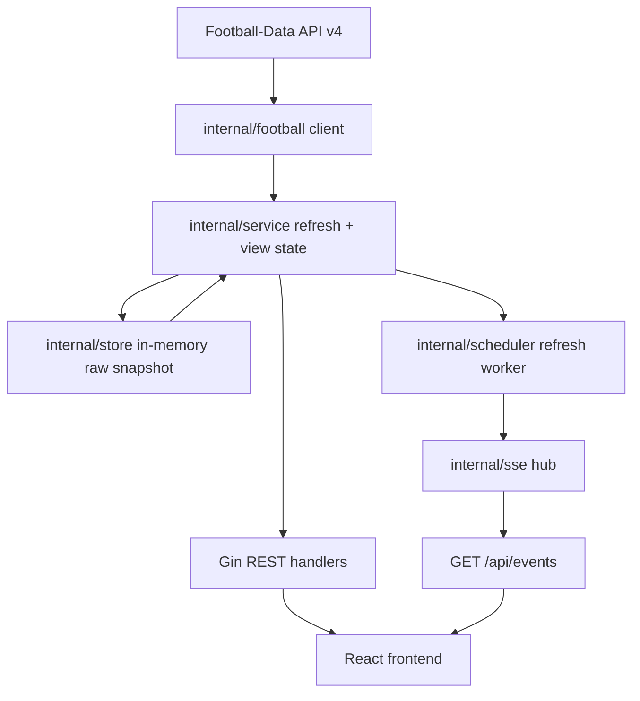

# World Cup Realtime Dashboard

Dashboard World Cup realtime với backend Go/Gin và frontend React/Vite. Backend là nguồn trạng thái trung tâm: dữ liệu được fetch từ Football-Data API hoặc `fake-data`, giữ snapshot runtime trong RAM, build view state, rồi đẩy cập nhật tới browser qua Server-Sent Events (SSE). Frontend chỉ fetch snapshot ban đầu, subscribe SSE và render.

Không có database, Redis, queue hay polling định kỳ từ frontend.

## Architecture



## Project Layout

```text
cmd/server/main.go          # Entrypoint: load config, start app, graceful shutdown
internal/app/               # Dependency wiring
internal/router/            # Gin routes, CORS, static frontend fallback
internal/handler/           # HTTP handlers
internal/service/           # Fetch orchestration, view-state business logic
internal/store/             # Thread-safe in-memory raw snapshot + refresh metadata
internal/football/          # Football-Data API/fake-data client and raw API types
internal/sse/               # SSE hub, clients, heartbeat, broadcast
internal/scheduler/         # Periodic refresh worker
frontend/                   # React/Vite client
web/                        # Production frontend build served by Gin
```

## Runtime Flow

1. Server starts, loads env config, performs an initial refresh.
2. Scheduler refreshes data based on `LIVE_REFRESH_SECONDS` or `IDLE_REFRESH_SECONDS` intervals.
3. Service compares raw state excluding fetch timestamps.
4. If match/team/competition data changed, server broadcasts one `state` SSE event with the full snapshot.
5. React fetches `/api/state` on mount, opens `/api/events`, and updates UI from SSE events.
6. If SSE reconnects, React fetches `/api/state` again as fallback.

## API

| Method | Endpoint | Purpose |
| --- | --- | --- |
| `GET` | `/api/health` | Healthcheck |
| `GET` | `/api/state` | Current full view-state snapshot |
| `GET` | `/api/events` | SSE stream, event name `state`, heartbeat comments |
| `GET` | `/api/team/:id` | Team detail fallback/debug |
| `GET` | `/api/match/:id` | Match detail fallback/debug |
| `GET` | `/api/matches` | Match lists fallback/debug |

`/healthz` is kept as a compatibility healthcheck alias.

## Environment

The server reads OS environment variables first, then `token.env` when present.

```env
FOOTBALL_API_BASE_URL=https://api.football-data.org/v4
FOOTBALL_DATA_TOKEN=your_token_here
FOOTBALL_DATA_COMPETITION=WC
FOOTBALL_DATA_SEASON=2026
PORT=8080
LIVE_REFRESH_SECONDS=10
IDLE_REFRESH_SECONDS=120
REFRESH_TIMEOUT_SECONDS=30
REFRESH_TIMEOUT_BUFFER_MS=500
CORS_ALLOWED_ORIGINS=*
```

- `LIVE_REFRESH_SECONDS`: Fast refresh interval when matches are live (default 10s).
- `IDLE_REFRESH_SECONDS`: Slow refresh interval when no matches are live (default 120s).
- `REFRESH_TIMEOUT_SECONDS`: Hard timeout for upstream API fetch (default 30s).
- `REFRESH_TIMEOUT_BUFFER_MS`: Headroom buffer to ensure timeout fires before the next tick (default 500ms).

Frontend build-time config:

```env
VITE_API_BASE_URL=
```

Leave `VITE_API_BASE_URL` empty when Gin serves the static build from the same origin. Set it to the backend origin, for example `https://api.example.com`, when deploying the frontend separately.

## Local Development

Install frontend dependencies when needed:

```bash
npm install
```

Run the Vite dev server:

```bash
npm run dev
```

Run the backend:

```bash
go run ./cmd/server
```


## Production Build

Build React into `web/`:

```bash
npm run build
```

Build the backend binary:

```bash
go build -o bin/worldcup-server ./cmd/server
```

Deploy the binary together with:

```text
web/
token.env               # optional; prefer host env vars for secrets
```

Run:

```bash
PORT=8080 ./bin/worldcup-server
```

The backend serves the static frontend from `web/` and exposes the API/SSE endpoints from the same process.

