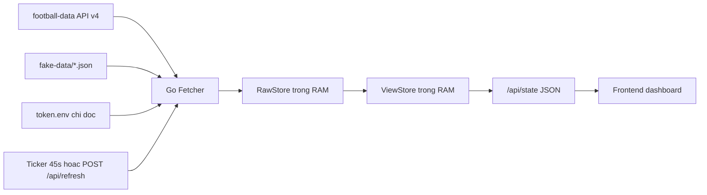

# World Cup Realtime Dashboard

Website Go + HTML/CSS/JS hien thi lich dau, tran hien tai, doi bong, cau thu, san van dong va bang xep hang World Cup tu football-data API. He thong khong dung database; tat ca du lieu sau khi fetch chi nam trong RAM.

## Bo cuc UI

```text
+--------------------------------------------------------------------------------+
| [WC logo]                                      API/FAKE | last update | refresh |
+----------------------+----------------------------------+----------------------+
| Cot trai             | Trung tam tren                   | Cot phai             |
| - Danh sach doi      | - Tran dang dien ra / tran tiep  | - Bang xep hang      |
| - Chon doi de xem    | - Doi nha, doi khach, ti so      | - Tab tung bang      |
|   chi tiet           | - Trang thai, gio, san           | - P/W/D/L/GD/Pts     |
|                      +----------------------------------+                      |
|                      | Trung tam giua                   |                      |
|                      | - Trang thai noi bat             |                      |
|                      | - Chi tiet doi dang chon         |                      |
|                      +----------------------------------+                      |
|                      | Trung tam duoi                   |                      |
|                      | - Upcoming truoc                 |                      |
|                      | - Finished nam cuoi              |                      |
|                      | - Postponed/paused/cancel rieng  |                      |
+----------------------+----------------------------------+----------------------+
```

## Luong du lieu



## Lop du lieu

- `RawStore`: giu response gan voi football-data gom `MatchesResponse`, `TeamsResponse`, `StandingsResponse`.
- `ViewStore`: du lieu da bien doi cho UI gom `teams`, `currentMatch`, `nextMatch`, `upcomingMatches`, `finishedMatches`, `specialMatches`, `standings`.
- Moi lan refresh, server thay the snapshot RAM bang mot snapshot moi. Khong ghi xuong database, khong giu lai du lieu sau khi restart.

## Quy tac sap xep tran dau

- `IN_PLAY`, `EXTRA_TIME`, `PENALTY_SHOOTOUT`: dua len khu vuc noi bat nhat.
- `SCHEDULED`, `TIMED`: sap xep theo thoi gian tang dan va hien truoc trong lich.
- `FINISHED`, `AWARDED`: day xuong cuoi danh sach chinh.
- `PAUSED`, `SUSPENDED`, `POSTPONED`, `CANCELLED`: tach rieng trong nhom dac biet.

## Cau truc thu muc

```text
.
|-- main.go
|-- token.env
|-- token.env.example
|-- fake-data/
|   |-- matches.json
|   |-- standings.json
|   `-- teams.json
|-- internal/
|   |-- config/
|   |-- football/
|   |-- server/
|   `-- store/
`-- web/
    |-- index.html
    |-- styles.css
    `-- app.js
```

## Chay website

```powershell
cd "D:\2nd world cup website"
go run .
```

Mo trinh duyet tai:

```text
http://localhost:8080
```

Neu API khong kha dung hoac token chua hop le, server tu dong dung `fake-data/` de giao dien van mo phong dung response va luong cap nhat.

## Cau hinh token

`token.env` nam cung cap voi `main.go` va chi duoc server doc luc khoi dong. File nay khong bi sua boi code.

```env
FOOTBALL_DATA_TOKEN=your_token_here
FOOTBALL_DATA_COMPETITION=WC
FOOTBALL_DATA_SEASON=2026
PORT=8080
REFRESH_SECONDS=45
USE_FAKE_DATA=false
```

Dat `USE_FAKE_DATA=true` khi muon demo offline bang fake JSON rieng.

## Endpoint noi bo

- `GET /api/state`: tra ve view model hien tai trong RAM.
- `POST /api/refresh`: ep server fetch lai ngay.
- `GET /healthz`: health check don gian.

## Nguon API

Thiet ke endpoint dua tren tai lieu football-data v4: <https://docs.football-data.org/general/v4/resources.html>
